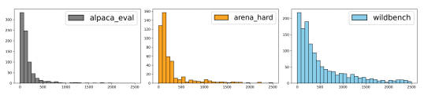
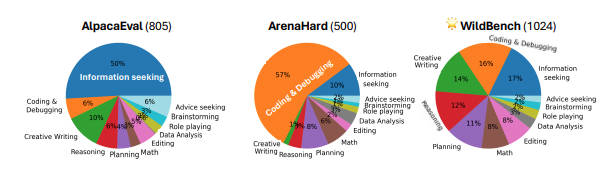
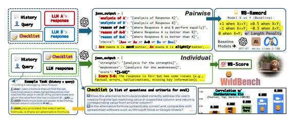

# 📘 WildBench 论文导读

**论文名称：WildBench: Benchmarking LLMs with Challenging Tasks from Real Users in the Wild**
**在 ICLR 2025 会议上发表为会议论文**
**GPT生成**
---

## 一、研究背景与动机

随着大语言模型（LLMs）的快速发展，如何**科学评估模型能力**成为关键问题。然而现有方法存在明显不足：

### 1. 传统基准的局限

- 如 MMLU 等，多为选择题
- 偏重知识与推理能力
- 难以反映真实用户需求

### 2. 人工评测的问题

- 成本高、效率低
- 数据不公开
- 难以复现与公平比较

### 3. 自动评测的不足

- 任务分布不真实
- 场景简单或偏科严重
- 缺乏复杂多轮交互

---

👉 **研究动机：**

构建一个**真实、多样、高难度**的评测体系，同时具备：

- 自动化
- 高一致性
- 可解释性

---

## 二、核心方法

论文提出了一个新的评测框架：**WildBench**

---

### 1. 数据构建（真实用户任务）

- 数据来源：WildChat（百万级真实对话）
- 最终数据规模：1024条高质量任务

#### 数据特点

- 来自真实用户（in-the-wild）
- 多轮对话（最多5轮）
- 长上下文
- 任务类型丰富（写作、编程、推理等）

#### 构建流程

1. 数据过滤（长度、语言、安全性）
2. Embedding 去重
3. 使用 GPT-4 标注难度
4. 剔除简单任务
5. 人工审核

👉 核心目标：  
**保证“真实 + 有区分度”**

---

### 2. Checklist 评估机制（关键创新）

针对“评估主观性强”的问题，引入：

#### Checklist

- 每个任务生成 5~10 个评估问题
- 类似评分标准（是否满足约束、逻辑是否清晰等）
- 由 LLM 生成 + 人工审核

#### 优点

- 提高一致性
- 增强可解释性
- 减少评估偏差

---

### 3. 两种评测指标

#### （1）WB-Reward（对比评测）

- 两个模型输出进行对比（pairwise）
- 输出结果：
  - 明显更好 / 略好 / 相等 / 略差 / 明显更差
- 分数映射：
  - +1 / +0.5 / 0 / -0.5 / -1

##### 改进点

- 使用多个 baseline 模型
- 引入 **长度惩罚（Length Penalty）**
  - 避免“长回答更占优势”

---

#### （2）WB-Score（单模型评分）

- 单个输出评分（1~10）
- 同时生成：
  - 优点分析
  - 缺点分析
  - 综合评分

##### 优点

- 成本更低
- 更高效
- 适合大规模评测

---

## 三、主要结果

### 1. 与人类评测高度一致

- WB-Reward 与 Chatbot Arena：
  - 相关性：**0.98**
- WB-Score：
  - 相关性：**0.95**

👉 优于：

- ArenaHard（0.91）
- AlpacaEval（0.87~0.89）

---

### 2. 评测更真实

图1：AlpacaEval、ArenaHard 和 WildBench 中查询长度的分布

相比其他基准：

| Benchmark  | 问题             |
| ---------- | -------------- |
| AlpacaEval | 任务简单、重复        |
| ArenaHard  | 偏向编程任务         |
| WildBench  | ✔ 多样 + 真实 + 高难 |

图2：AlpacaEval、ArenaHard 和 WildBench 中的任务类别分布
---

### 3. 长度偏置问题得到缓解

- 长文本不再天然占优
- Length Penalty 有效降低偏差

图3：WILDBENCH 的评估框架。该框架包含两个指标：WB-Score 用于个体评估，WB-Reward 用于成对评估。评估过程使用检查清单进行指导。长度惩罚用于缓解长度偏差。WB-Reward 和 WB-Score 均与 Chatbot Arena 上基于人工的 LLM 排名具有很强的相关性。
---

### 4. 支持细粒度分析

- 可按任务类型分析模型能力
- 能发现模型“偏科”问题

---

## 四、个人小结

### ✅ 1. 更贴近真实应用场景

从“人工构造题目”转向“真实用户问题”，提升评测价值。

---

### ✅ 2. Checklist 机制非常关键

将模糊评价拆解为结构化标准：

- 提高一致性
- 增强可解释性

👉 对实际AI系统评估具有很强参考价值

---

### ✅ 3. 平衡三大目标

- 准确性
- 自动化
- 可解释性

---

### ⚠️ 局限性

1. 依赖强模型（如 GPT-4）作为评审
2. Checklist 本身可能存在偏差
3. 数据主要为英文

---

### 💡 延伸思考

- 是否可以用于中文场景评测？
- 是否可以扩展到多模态任务？
- 是否可以训练专用评测模型替代 GPT-4？

---

## 五、一句话总结

> WildBench 的核心思想是：  
> **让大模型评测从“标准化考试”走向“真实世界问题”。**

---

