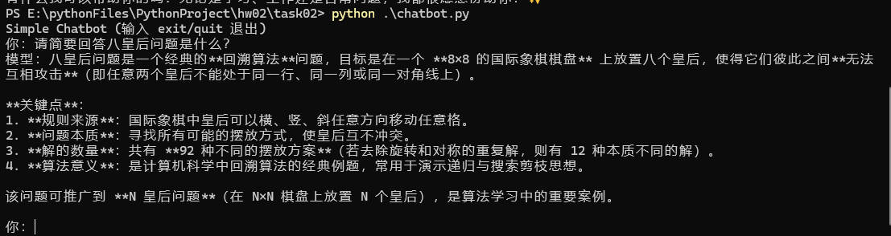

# task02 快速运行说明（DeepSeek / OpenAI 兼容接口）

## 运行环境

- Windows 10/11
- Python 3.10+（示例使用 conda 环境也可）
- 需要可访问对应模型 API 的网络环境（如需代理请先配置好）

## 依赖安装

进入目录并安装依赖：

```bash
cd \hw02\task02
python -m pip install -r requirements.txt
```

如果你使用 conda：

```powershell
conda activate test
python -m pip install -r requirements.txt
```

## 配置 API Key / 环境变量

本示例使用 **OpenAI 兼容**的调用方式，推荐按 DeepSeek 官方示例配置：

在 PowerShell（且已激活你的 conda 环境）中设置：

```powershell
$env:DEEPSEEK_API_KEY = "sk-xxx"

$env:OPENAI_BASE_URL  = "https://api.deepseek.com"

$env:CHAT_MODEL       = "deepseek-chat"
```

说明：
- **DEEPSEEK_API_KEY**：必填（脚本会优先读取它）。
- **OPENAI_BASE_URL**：不设时脚本默认使用 `https://api.deepseek.com/v1`；设为 `https://api.deepseek.com` 也可（与 DeepSeek 示例一致）。
- **CHAT_MODEL**：不设时默认 `deepseek-chat`。

可用下面命令检查变量是否生效（不泄露完整 key）：

```powershell
python -c "import os; k=os.getenv('DEEPSEEK_API_KEY'); print('DEEPSEEK_API_KEY=', (k[:6]+'...') if k else None); print('OPENAI_BASE_URL=', os.getenv('OPENAI_BASE_URL')); print('CHAT_MODEL=', os.getenv('CHAT_MODEL'))"
```

## 运行命令

### 1）交互式聊天

```bash
python chatbot.py
```

示例（你的输出内容会因模型而异）：

```text
Simple Chatbot (输入 exit/quit 退出)
你：你是谁？
模型：我是一个 AI 助手，可以回答问题、总结内容、协助写作与编程等。
```
截图如下：

图1：问答截图

## 常见报错与处理

- **鉴权失败：API Key 无效**：key 复制错误/已作废/与平台不匹配；请到平台控制台重置生成新 key，并重新设置环境变量。
- **Unknown scheme for proxy URL**：代理变量里混入了引号或 `%22`；清理 `HTTP_PROXY/HTTPS_PROXY` 后按正确格式重设。
- **Connection error**：网络/代理/防火墙导致无法访问 API；先确认 `OPENAI_BASE_URL` 正确，再检查代理与网络连通性。

